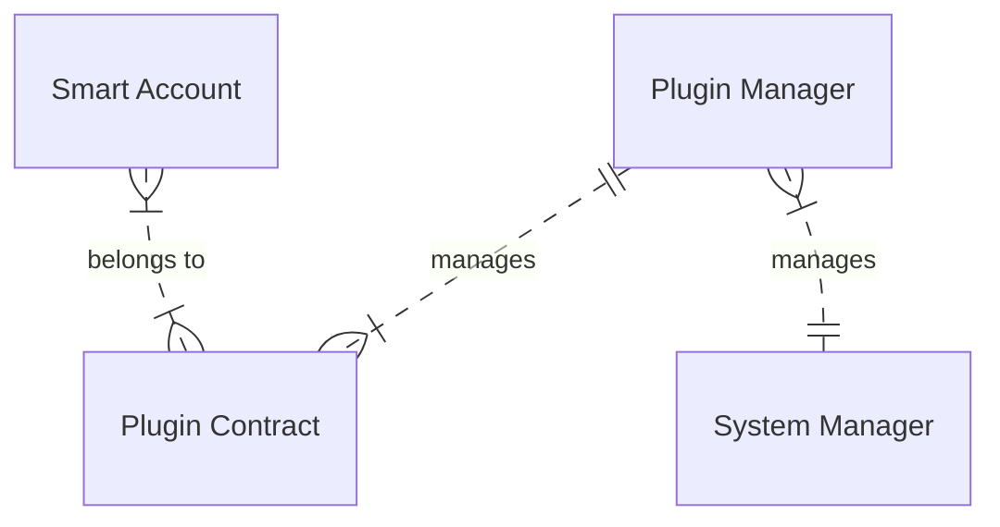

Pyxis Smart Account is a collection of smart contracts that works together with Aura Network's [Smart Account](https://github.com/aura-nw/aura/tree/main/x/smartaccount) module to provide a secure and flexible way to manage your assets.

# Features

- **Native Smart Account solution**: Pyxis Smart Account is a native solution that works with Aura Network's Smart Account module. A Pyxis smart acconut works just like a normal account, but with more features.

- **Recoverable**: Pyxis smart account offers multiple ways to recover your account in case you lose your private key.

- **Extensible**: Pyxis smart account is designed to be extensible with curated plugins. You can add new features to your account by installing plugins from the Pyxis plugin store.

- **Secure**: We audit our code regularly to ensure the security of your assets.

# Architecture

Pyxis smart account is built on top of Aura Network's [Smart Account](https://aura.network) module, which provides programmable account features. Pyxis makes these features more accessible to users by providing an extensible plugin system.

A plugin system is essential for a smart account because it allows for a flexible and customizable user experience. With a plugin system, users can add or remove features as needed, making the account more tailored to their specific needs. This can improve efficiency and productivity, as well as enhance the overall user experience. Additionally, a plugin system allows for easier maintenance and updates, as changes can be made to individual plugins without affecting the entire system.

**Note:** For security reasons, the smart contract will store the checksum of registered plugin contract so that whenever that plugin contract is migrated, it will NOT work anymore.

System manager is the admin of the Pyxis ecosystem. TODO: explain further. We use a multisig account as the system manager.

Plugin managers are the ones who create and manage plugin contracts. At the moment, there is only one which is managed by Pyxis. In the future, third-party companies could have their own plugin manager accounts to manage their plugins. When a smart account is instantiated, users need to provide one or more plugin manager contract. The smart account will then use these plugin manager contracts to verify all plugins that are installed on the smart account.

Plugin contracts are contracts which hold the logic, configuration, and state of plugins. The corresponding plugin manager can enable, disable a plugin or upgrade the plugin contract.

Each plugin contract could have a list of plugins which are essentially some executable functions. When a smart account registers a plugin, it will give a configuration to the plugin contract. After that, whenever the smart account wants to execute a transaction, registered plugin contracts will be called to verify the transaction. Each will receive a list of messages, verify the content, update its states, and return a boolean indicating whether the list of messages is valid or not. If all plugins return true, the transaction will be executed. Otherwise, the transaction will be rejected.

## Base smart account

# Requirements

- [Aura Network's smart account module](https://github.com/aura-nw/aura/tree/main/x/smartaccount): this is the core module that Pyxis smart account works with. You need to install this module to your chain to use Pyxis smart account.
- [Cosmwasm](https://cosmwasm.com/): Pyxis smart account is built with Cosmwasm smart contract framework. You need to install Cosmwasm to your chain to use Pyxis smart account.