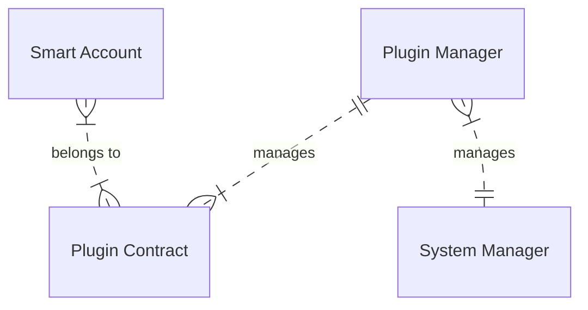
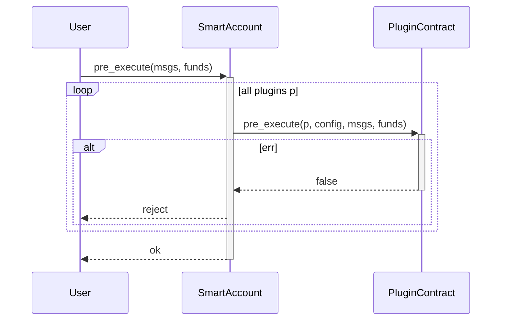
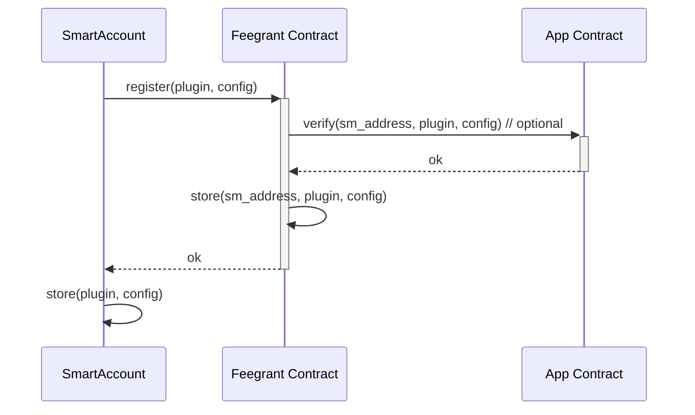
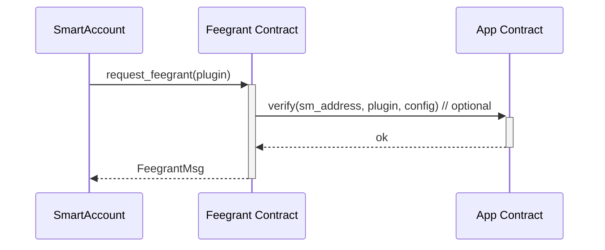
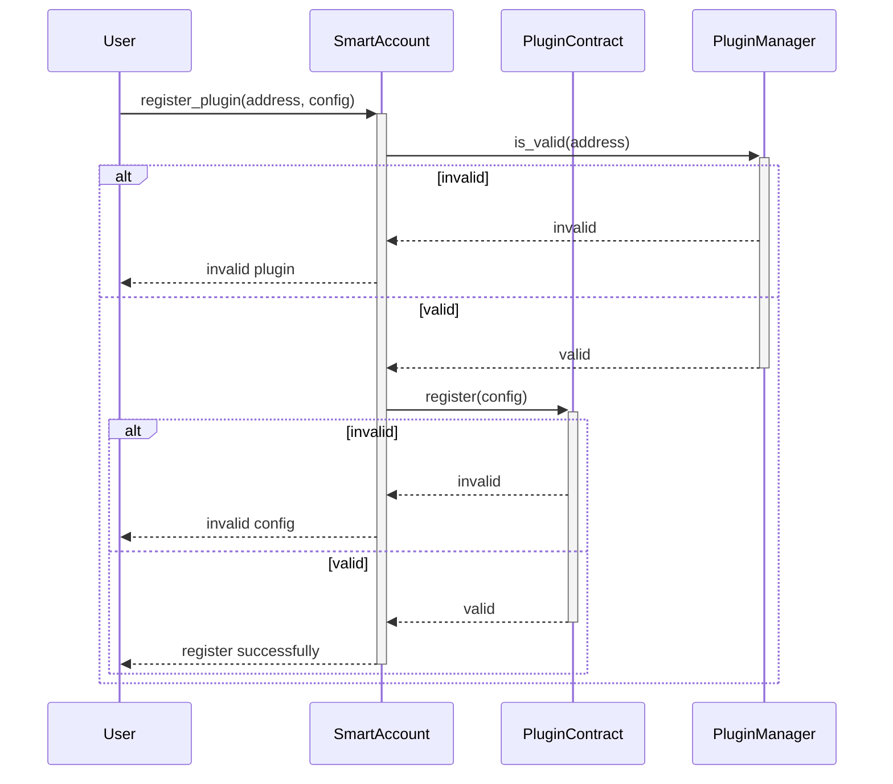
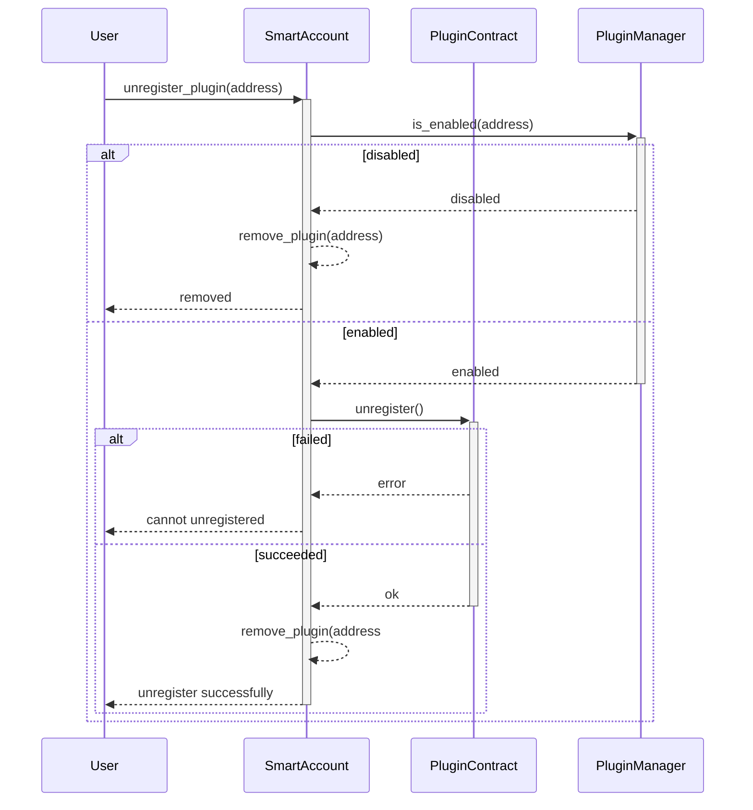

A plugin system is essential for a smart account because it allows for a flexible and customizable user experience. With a plugin system, users can add or remove features as needed, making the account more tailored to their specific needs. This can improve efficiency and productivity, as well as enhance the overall user experience. Additionally, a plugin system allows for easier maintenance and updates, as changes can be made to individual plugins without affecting the entire system.

**********Note:********** For security reasons, the smart contract will store the checksum of registered plugin contract so that whenever that plugin contract is migrated, it will NOT work anymore.

# Overview



System manager is the admin of the whole system (could be the same multisig that manages smart account code_id)

Plugin managers are the ones who create and manage plugin contracts. They could come from a third-party company. When a smart account is instantiated, users need to provide a plugin manager contract.

Plugin contracts are contracts which hold the logic, configuration, and state of plugins. A smart account need to register with a plugin before using it. 

Each plugin contract could have a list of plugins which are essentially some executable functions. Whenever a transaction is executed, registered plugin contracts will receive a submessage to its `pre_execute` and `after_execute` functions containing the transaction’s information. If the plugin throw an error in its `after_execute` function, the transaction will be rejected. Throw in `pre_execute` function will not have any effect because of the way smart account module works. The plugin contract can still update its state in `pre_execute` function.


## User sends a transaction



The smart account will forward the called messages and funds to every registered plugin in both `pre_execute` function and `after_execute` function. A plugin can be a simple function that checks for allowed funds or a complicated contract that tracks a user’s activities.

For gas saving, a plugin should also register a simple message filter to the Smart Account, so that only messages that are relevant to that plugin will be checked. For the same reason, we also required a plugin to register its maximum gas cost which will be set when calling.

There are some exceptions to when a plugin is called:

- In `pre_execute`, when users unregister or disable a plugin ~~or that plugin is flagged as disabled by Pyxis Plugin Manager,~~ that plugin will not be called.
- In `after_execute`, when users register, unregister or disable a plugin, that plugin will not be called.
- Recovery plugins will only be called in a transaction contains a recovery message.

## Working with Authz

With plugins, we can allow another actor to perform certain functions for users, e.g. cron-contracts.

For that, we need users to `authz` for the plugin contract to call the expected messages and register a plugin which verifies messages for more specific conditions. 

For example, a user wants a cron-contract to perform swap from USDT to AURA every morning. The user needs to use `authz` to allow the cron-contract to call `MsgExecuteContract` messages. Then, the user will register a plugin which checks every message if it was not called directly by the user. An example config which allows a cron contract to execute swap on behalf of a smart account could be:

```json
{
  "sender": "cron-contract-address",
  "message": "MsgExecuteContract",
  "message_content": {
    "contract_address": "swap-contract-address",
    "actions": ["swap"],
    "funds": [
      {
        "denom": "uaura",
        "amount": [0, 10000000]
      }
    ]
  }
}
```

We could have a set of validation rules for users to choose from, which could cover many simple cases.
 
> For security reasons, authorized actors cannot call messages which could alter the smart account or interact with plugins such as register, unregister, disable a plugin or change a plugin configuration.

## Examples

**Spend-limit plugin:** this is a plugin which only allows a smart account to spend a limited amount of some coins/token in a fixed time frame. This can be achieved by storing the amount of coins/token before a transaction then checking it again at the end to verify the spending condition. The plugin can accept a flexible configuration such as:

```json
[
  {
    "denom": "uaura",
    "spending_limit": 10000000,
    "window": 86400 // 1 day in seconds
  },
  {
    "denom": "aura1...",
    "spending_limit": 10000,
    "window": 123412
  }
]
```

**Feegrant-on-condition plugin:** 

A user can request feegrant from a contract on certain conditions. First, the user needs to register this plugin with the correct configuration. After registered, users can request for feegrant from this contract itself, which will check for the registration of this plugin. For any transaction which users want to use the feegrant, users will need to put this contract address as the `fee_payer`. With this information, the plugin can verify if the user is still permitted to use the fee grant. When users unregister this plugin, all feegrants will be revoked as well.





Every time the **smart account** wants to interact with the **app contract** using feegrant, it will set the `fee_payer` field in transaction to the **feegrant contract**. The **feegrant contract** will verify that:

- in this transaction, the **smart account** only interacts with the **app contract**,
- the **smart account** is still permitted to use feegrant,
- the setting of gas and fee is reasonable, that is, gas limit is in a reasonable range for all messages and fee is reasonable given a preset gas price.

If all the above are passed, the transaction will go through, otherwise, the **feegrant contract** can reject the transaction as well as revoke any feegrant to that **smart account**.

**Loyalty plugin:**

This plugin enables rewarding users of an application with on-chain rewards by tracking their activities. For example, it can count the number of swaps on a DEX or the total volume of specific tokens and convert that into a point system.

Currently, apps can either track this information off-chain or implement their own tracking system. However, implementing such a system requires additional functions to be added to a contract, which can be complicated and not easily extensible.

Using this plugin, however, is limited to smart accounts and not available for regular accounts.

**Recovery plugin:**

Users can choose their preferred recovery methods by registering the corresponding recovery plugins. There will be no need to stick with the default method of the contract.

# Smart Account Interface

To use the plugin system, a smart account needs to implement the following functions:

## register_plugin(address, config)

A smart account needs to register a plugin contract before using it. The smart contract will call to Plugin Manager contract to check if the address is a valid plugin.



## unregister_plugin(address)

This function will be called when a user wants to remove a plugin. The plugin contract can take additional actions to remove the user their data.



## update_plugin(address, status)

A smart account can enable or disable a plugin. When a plugin is disabled, it will not be called in `pre_execute` and `after_execute` functions. Currently, a plugin can only be disabled if the plugin manager contract has disabled it. The intended usecase for this function is for user to temporary disabled an faulty plugin but still preserve their data. For other cases, users need to unregister the plugin.

# Plugin Contract Interface

A normal plugin contract needs to have at least 4 functions: `register`, `unregister`, `pre_execute` and `after_execute`. For recovery plugins, they need to have 3 functions: `register`, `unregiser`, and `recover`.


## Messages

## Register(config)
This function will be called when a user wants to register a plugin it's managed. The function takes a plugin name and its configuration. The smart contract will call to Plugin Manager contract to check if the address is a valid plugin.

## Unregister()
This function will be called when a user wants to remove a plugin. The contract can take additional actions to remove the user their data.

## PreExecute(msgs, call_info, is_authz)
This function will be called in the `pre_execute` phase of a transaction. It will be called by ante handler of the smart account module.

## AfterExecute(msgs, call_info, is_authz)
This function will be called in the `after_execute` phase of a transaction. It will be called by post handler of the smart account module. `call_info` will contain information about caller and gas consumption.

## Recover(caller, pub_key, credentials)
`caller` is the address that executes the recovery transaction and `credentials` are information that is necessary to verify the permission of `caller`. `pub_key` is the new public key that is associated with this smart account.


# Plugin Manager Contract Interface

A plugin manager contract is a registry of plugin contracts. Pyxis Plugin Manager will be the default plugin manager contract. However, users can choose to use another plugin manager contract if they want to. For example, a company can create their own plugin manager contract to manage their own plugins.

## Messages

A plugin manager contract needs to implement the following functions:

## AllowPlugin(name, plugin_type, code_id, version, address, enabled)
This function will be called by an admin of the plugin manager contract. The plugin manager contract will check if the submitted information is valid and store it in its state.

## DisallowPlugin(address)
This function will be called by an admin of the plugin manager contract. The plugin manager contract will remove the plugin from its state.

## UpdatePlugin(name, plugin_type, code_id, version, address, enabled)
This function will be called by an admin of the plugin manager contract. The plugin manager contract will update the plugin information in its state.

## MigratePlugin(address, new_code_id, migrate_msg)
This function will be called by an admin of the plugin manager contract. This function will migrate the plugin contract to a new code id with the submitted `migrate_msg`. This function is needed because plugin manager must known when a plugin contract changed to protect smart accounts from malicious plugins. Any plugins that are migrated without the permission of the plugin manager will be disabled. For that reason, when a plugin contract is instantiated, it must set the plugin manager contract as its admin.

## Queries

# Security

## Plugin Management Guidelines

We outline the management process of plugins which is used in order to ensure the security and integrity of smart accounts. Plugins are essential components that enhance the functionality of smart accounts. However, it is crucial to follow certain protocols to protect against potential vulnerabilities and malicious activities.

## Auditing Plugins
Before a plugin can be used by smart accounts, it must undergo a thorough auditing process. This involves a comprehensive review of the plugin's code and functionality to ensure that it meets the required security standards. Only audited plugins are allowed to be used by smart accounts.

## Contract Migration Restrictions
Once a plugin contract is registered, it cannot be migrated without the permission of the plugin manager contract. This restriction ensures that any changes to the plugin's contract are carefully controlled and authorized. Unauthorized migration of a plugin contract is strictly prohibited. In the event that a plugin is migrated, the owner of the smart account associated with the plugin must be promptly notified. *(not implemented yet) Additionally, the migrated plugin will be automatically disabled until the user re-registers it. This mechanism ensures that users are aware of any changes to their plugins and have the opportunity to review and re-enable them.*

## Centralized Plugin Management
The plugin manager has the authority to disable or remove a plugin at any time if it is found to be malicious or poses a security risk. This capability allows for swift action to be taken in response to identified threats, ensuring the overall security of the smart accounts.

## User Control
Users have the ability to disable or remove a plugin from their smart accounts at any time. This ensures users to have full control over the plugins they choose to utilize and allows them to take immediate action if they suspect any issues or vulnerabilities.

## Authz Message Limitations
It is important to note that authz messages cannot be used to change the state of plugins or interact with plugins. This limitation prevents unauthorized manipulation of plugins through the use of authz, further safeguarding the integrity of smart accounts.

## Multisig as Admin of Plugin Manager
To further secure the plugin manager, a multisig account is used as the admin of the plugin manager. TBD.

By adhering to these guidelines, we can ensure the secure and reliable operation of smart accounts while leveraging the benefits of plugins to enhance their functionality.